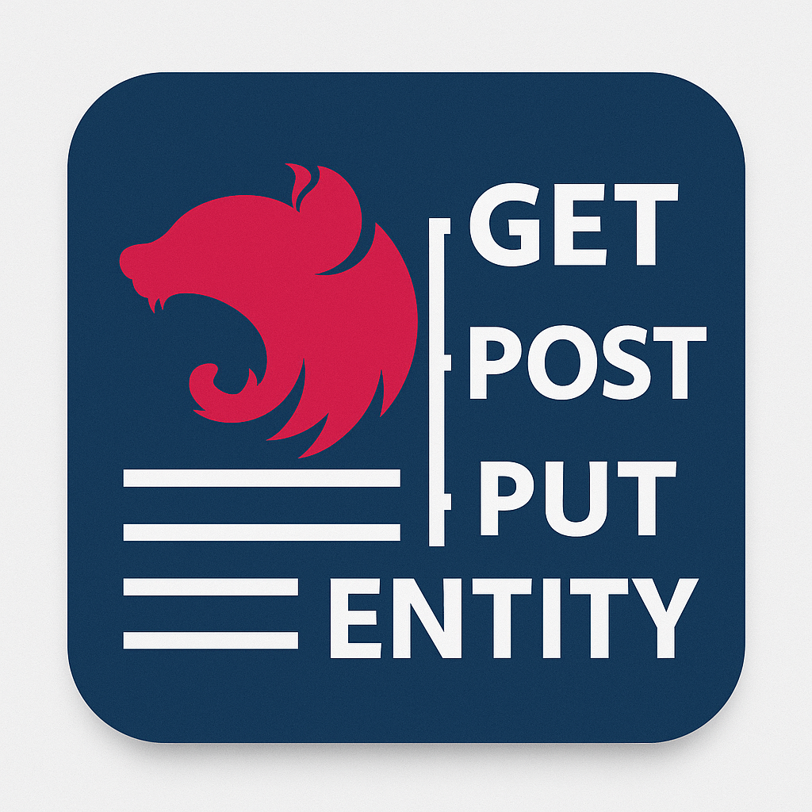

# NestJS Dashboard

A powerful VS Code extension that provides a comprehensive dashboard view of all HTTP API endpoints and TypeORM entities in your NestJS projects. Now with AI-powered test generation, advanced analytics, and monorepo support. Streamline your development workflow by having instant access to your entire API structure, data models, and intelligent tooling.

## ✨ Features

### 🧪 Intelligent Test Generation (NEW in v0.1.0)

- **AI-Powered Test Creation**: Generate comprehensive tests for endpoints and controllers using GitHub Copilot
- **Multiple Test Types**: Support for unit tests, integration tests, and e2e tests
- **One-Click Generation**: Beaker icons on each endpoint and controller for instant test creation
- **Smart Test Templates**: Contextually aware test generation based on endpoint patterns and existing code
- **GitHub Copilot Integration**: Choose from GPT-4o, GPT-4, or GPT-3.5 Turbo models for optimal results

### 📊 Advanced Analytics Dashboard (NEW in v0.1.0)

- **Interactive Statistics**: Comprehensive webview showing detailed API analytics
- **Method Distribution**: Visual breakdown of endpoints by HTTP method (GET, POST, PUT, DELETE, etc.)
- **Controller Analysis**: Detailed statistics on controller distribution and endpoint density
- **Visual Charts**: Interactive charts and graphs for better insights
- **Performance Metrics**: Track API structure complexity and patterns

### 🏢 Monorepo Support (NEW in v0.1.0)

- **Automatic Detection**: Smart detection of monorepo project structures
- **Multi-App Management**: Switch between different apps in your monorepo
- **Workspace Navigation**: Support for `apps/`, `libs/`, and custom folder structures
- **Unified Dashboard**: Consolidated view across multiple NestJS applications

### 🎯 Comprehensive API Discovery

- **Smart Parsing**: Automatically discovers controllers and HTTP methods in `src/`, `apps/`, and `libs/` folders
- **Complete Endpoint Information**: Displays HTTP method, full path, controller name, handler method, and optional summaries
- **Multi-Project Support**: Works with monorepo structures and multiple NestJS applications
- **Method-Specific Icons**: Visual indicators for GET, POST, PUT, DELETE, PATCH, and other HTTP methods
- **Enhanced Tooltips**: Detailed hover information with endpoint metadata

### 📖 Swagger Integration (NEW in v0.1.0)

- **Built-in Swagger Parser**: Automatically detects and parses Swagger documentation
- **Enhanced Metadata**: Enriched endpoint information from Swagger definitions
- **Quick Setup**: Tools to create new Swagger configurations in your project
- **Documentation Sync**: Keep your dashboard synchronized with Swagger docs

### 🗃️ Entity Management

- **TypeORM Entity Detection**: Automatically discovers all TypeORM entities in your project
- **Property Visualization**: Shows entity properties with their types and decorators
- **Relationship Mapping**: Identifies and displays entity relationships (OneToMany, ManyToOne, OneToOne, ManyToMany)
- **Decorator Recognition**: Displays TypeORM decorators like @PrimaryGeneratedColumn, @Column, etc.
- **Smart Icons**: Different icons for primary keys, columns, and relationships
- **Expand & Navigate**: Click on entities to both expand property details AND navigate to source code

### 🔄 Real-time Updates

- **Auto-refresh**: Automatically updates when TypeScript files change
- **Manual Refresh**: Use the refresh button or command palette for instant updates
- **Live Monitoring**: Keeps your dashboard synchronized with code changes
- **Performance Optimized**: Improved caching and parsing for faster updates

### 🎨 Clean Interface

- **Multi-Panel Layout**: Dedicated panels for GitHub Copilot, API Endpoints, and Entities
- **Organized Display**: Clear, hierarchical view of all endpoints and entities
- **Collapsible Sections**: Separate sections for better organization
- **Quick Navigation**: Click to jump directly to endpoint or entity definitions
- **Interactive Elements**: Clickable icons and buttons for enhanced functionality

## 📦 Installation

### From VS Code Marketplace

1. Open VS Code
2. Go to Extensions (Ctrl+Shift+X)
3. Search for "NestJS Dashboard"
4. Click Install

### Manual Installation

1. Download the `.vsix` file from [releases](https://github.com/yensubldg/nestjs-dashboard-extension/releases)
2. Open VS Code
3. Run `Extensions: Install from VSIX...` from the Command Palette
4. Select the downloaded `.vsix` file

## 🚀 Usage

### Getting Started

1. Open any NestJS project in VS Code
2. Look for the **NestJS Dashboard** icon in the Activity Bar (left sidebar)
3. Click to open the dashboard panel
4. Your API endpoints will automatically appear under "API Endpoints"
5. Your TypeORM entities will automatically appear under "Entities"
6. Configure GitHub Copilot in the "GitHub Copilot" panel for AI-powered features

### Test Generation

1. **For Individual Endpoints**: Click the beaker icon (🧪) next to any endpoint
2. **For Entire Controllers**: Click the beaker icon next to any controller name
3. **Configure AI Model**: Use the GitHub Copilot panel to select your preferred model
4. **Review Generated Tests**: Tests are created in appropriate test directories with proper structure

### Statistics Dashboard

1. Click the graph icon in the API Endpoints panel header
2. View interactive charts showing your API structure
3. Analyze endpoint distribution and controller patterns
4. Export statistics for documentation or reporting

### Monorepo Management

1. **Automatic Detection**: The extension automatically detects monorepo structures
2. **App Selection**: Use the folder icon to switch between different apps
3. **Toggle Mode**: Enable/disable monorepo mode as needed
4. **Unified View**: See all endpoints across multiple applications

### Available Commands

- **Refresh API Endpoints**: Manually refresh endpoint and entity lists
- **Generate Test for Endpoint**: Create AI-powered tests for specific endpoints
- **Generate Tests for Controller**: Create comprehensive test suites for entire controllers
- **Show Statistics Dashboard**: Open the analytics webview
- **Select App (Monorepo)**: Switch between apps in monorepo projects
- **Configure GitHub Copilot**: Set up AI model preferences
- **Open Swagger UI**: Launch Swagger documentation interface

### Keyboard Shortcuts

Access commands via Command Palette (`Ctrl+Shift+P`):

- `NestJS Dashboard: Refresh API Endpoints`
- `NestJS Dashboard: Show Statistics Dashboard`
- `NestJS Dashboard: Configure GitHub Copilot`
- `NestJS Dashboard: Select App (Monorepo)`

## 🛠️ Requirements

- **VS Code**: Version 1.85.0 or higher (required for AI features)
- **NestJS Project**: Works with any NestJS TypeScript project
- **TypeORM** (optional): For entity detection and visualization
- **GitHub Copilot** (optional): For AI-powered test generation
- **File Structure**: Recognizes standard NestJS project structures (`src/`, `apps/`, `libs/`)

## ⚙️ Extension Settings

Configure the extension through VS Code settings:

### Basic Configuration

- `nestjsDashboard.rootFolder`: Root folder to scan (default: "src")
- `nestjsDashboard.showMethodColors`: Enable HTTP method colors (default: true)
- `nestjsDashboard.enableHoverTooltips`: Show detailed tooltips (default: true)

### Monorepo Settings

- `nestjsDashboard.monorepoMode`: Enable monorepo support (default: false)
- `nestjsDashboard.selectedApp`: Selected app in monorepo mode

### AI & Test Generation

- `nestjsDashboard.enableTestGeneration`: Enable test generation features (default: true)
- `nestjsDashboard.useGitHubCopilot`: Use GitHub Copilot for test generation (default: true)
- `nestjsDashboard.copilotModel`: Preferred Copilot model (default: "gpt-4o")

### Integration Features

- `nestjsDashboard.enableSwaggerIntegration`: Enable Swagger integration (default: true)
- `nestjsDashboard.enabledRouteGroups`: Route groups to display

## 📋 Supported Decorators

The extension recognizes the following NestJS HTTP decorators:

- `@Get()`
- `@Post()`
- `@Put()`
- `@Patch()`
- `@Delete()`
- `@Options()`
- `@Head()`
- `@All()`

## 🐛 Known Issues

- Large projects (500+ endpoints) may experience slower initial parsing
- GitHub Copilot features require the GitHub Copilot extension to be installed and configured
- Some complex monorepo structures may need manual app selection
- Dynamic route parameters in complex inheritance scenarios might not be fully resolved

Found a bug? [Report it here](https://github.com/yensubldg/nestjs-dashboard-extension/issues)

## 🗂️ Release Notes

### 0.1.0 (Latest Release)

- 🧪 **AI-Powered Test Generation**: Generate comprehensive tests using GitHub Copilot
- 📊 **Statistics Dashboard**: Interactive analytics and visualizations
- 🏢 **Monorepo Support**: Enhanced support for multi-app repositories
- 📖 **Swagger Integration**: Built-in Swagger documentation support
- 🎯 **Enhanced Configuration**: Centralized configuration management
- ⚡ **Performance Improvements**: Faster parsing and better caching

### 0.0.4

- 📝 **Documentation**: Updated README.md with the latest release information and general improvements.

### 0.0.3

- ✨ **TypeORM Entity Detection**: Automatically discovers and displays TypeORM entities.
- 🔍 **Property Visualization**: Shows entity properties, types, and decorators.
- 🔗 **Relationship Mapping**: Identifies and displays entity relationships (OneToMany, ManyToOne, etc.).
- 🎨 **Decorator Recognition**: Highlights TypeORM decorators like `@PrimaryGeneratedColumn`, `@Column`.
- 🚀 **Enhanced Navigation**: Click to expand entity details and jump to source code.

### 0.0.2

- 🛠️ **Build Process**: Switched to esbuild for faster bundling and development.
- ⚙️ **Performance**: Improved initial parsing speed for large projects.
- 🐛 **Bug Fixes**: Addressed minor parsing issues and improved stability.

### 0.0.1 (Initial Release)

- ✅ Core API endpoint discovery
- ✅ Sidebar dashboard integration
- ✅ Auto-refresh on file changes
- ✅ Manual refresh functionality
- ✅ Support for standard NestJS project structures

## 🤝 Contributing

We welcome contributions! Please see our [Contributing Guide](https://github.com/yensubldg/nestjs-dashboard-extension/blob/main/CONTRIBUTING.md) for details.

### Development Setup

1. Clone the repository
2. Run `npm install`
3. Press `F5` to launch the extension in a new VS Code window
4. Open a NestJS project to test the extension

## 📄 License

This extension is released under the [MIT License](LICENSE).

## 🔗 Links

- **GitHub Repository**: [nestjs-dashboard-extension](https://github.com/yensubldg/nestjs-dashboard-extension)
- **VS Code Marketplace**: [NestJS Dashboard](https://marketplace.visualstudio.com/items?itemName=yensubldg.nestjs-dashboard)
- **Issue Tracker**: [Report Issues](https://github.com/yensubldg/nestjs-dashboard-extension/issues)
- **Changelog**: [View Changes](CHANGELOG.md)

## 🙏 Support

If you find this extension helpful, please:

- ⭐ Star the [GitHub repository](https://github.com/yensubldg/nestjs-dashboard-extension)
- 📝 Leave a review on the [VS Code Marketplace](https://marketplace.visualstudio.com/items?itemName=yensubldg.nestjs-dashboard)
- 🐛 Report issues or suggest features
- 💡 Share your feedback and feature requests

---

Enjoy coding with NestJS Dashboard! 🚀✨
